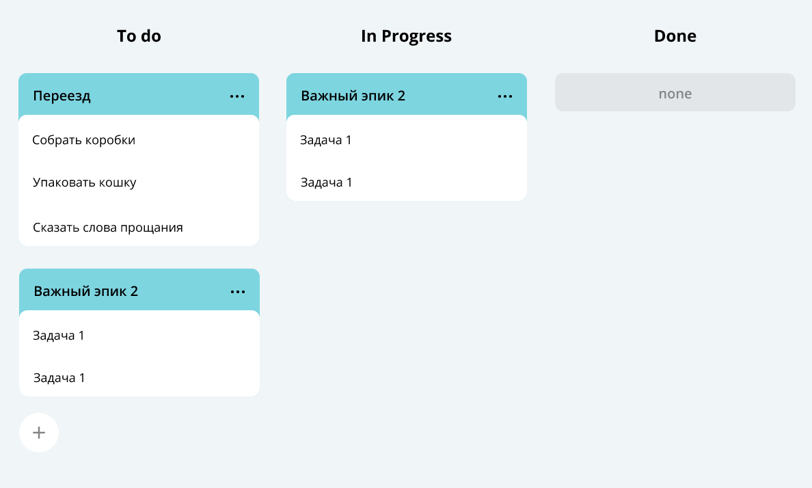
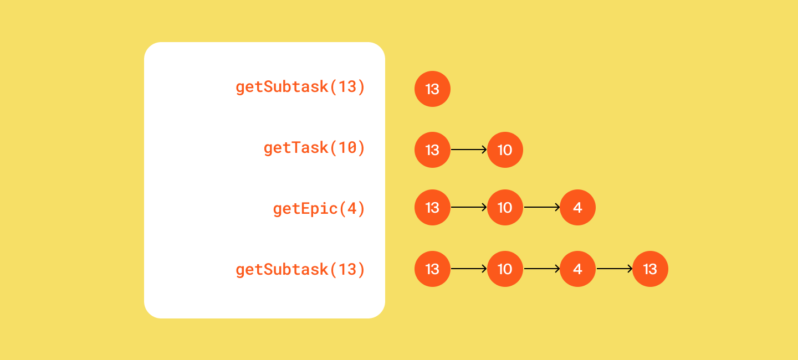
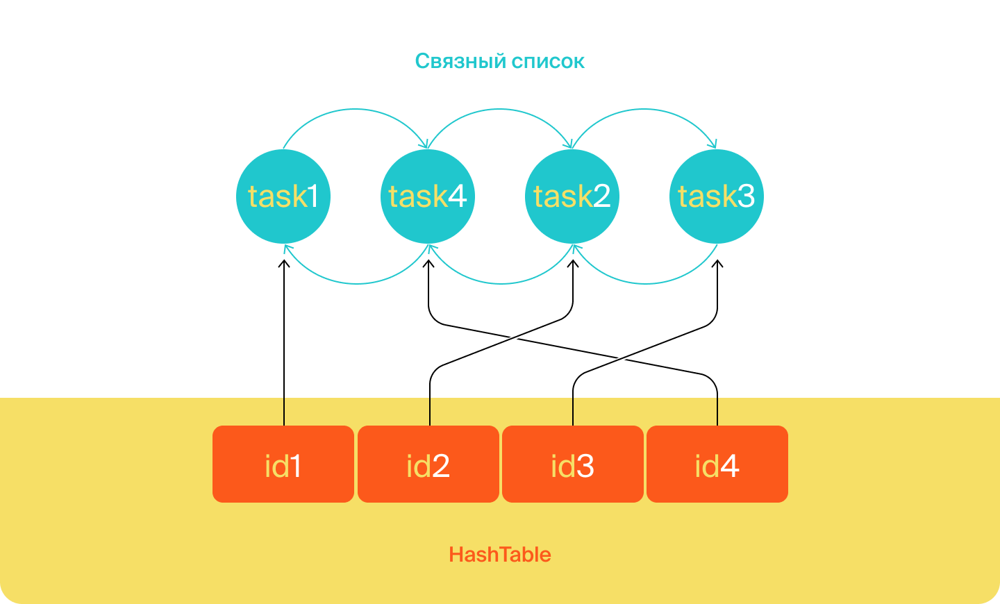

# Java kanban
## Третья работа
## Трекер задач
### Идея проекта.
Суть проекта заключается в реализации помощника по организации работы. Изначально kanban - это доска для организации работы на производстве в Японии, где на доску вывешивались задачи, поставленные мастерами, ответственными за работу, для выполнения. Доска помогает разбить задачи на более мелкие, чтоб упростить и ускорить процесс реализации. В рамках обучения, я написал доску с возможностью реализации простых `CRUD` операций и отправки и получения данных с сервера, с помощью библиотек `Gson` и `HttpServer`. В проекте реализованы два сервера, один из которых отвечает за приём, отправку, старт и остановку работы сервера, второй - за внутреннюю реализацию процессов работы сервера. Так же, в приложении есть возможность сохранять данные локально (в файле, формата CSV с возможностью последующего считывания с файла при перезагрузке приложения) и написаны `JUnit` тесты.


Пользователь не будет видеть консоль вашего приложения. Поэтому нужно сделать так, чтобы методы не просто печатали что-то в консоль, но и возвращали объекты нужных типов.
Вы можете добавить консольный вывод для самопроверки в класcе Main, но на работу методов он влиять не должен.

#### Как проверить эндпоинты
Проверить API можно несколькими способами. Через `Insomnia`. С помощью плагина для браузера, к примеру, `RESTED`, `Postman`, `RESTClient` или других. Выбрать и скачать подходящий можно по ссылке. В IDEA через шаблоны HTTP-запросов — scratch file. Нажмите комбинацию `CTRL+SHIFT+ALT+Insert` и выберите `HTTP Request`.


### Проект был разделен на несколько частей

<details>
 <summary>Первая часть</summary>

##### Типы задач
Простейшим кирпичиком такой системы является задача (англ. task). \
У задачи есть следующие свойства:  
1. Название, кратко описывающее суть задачи (например, «Переезд»).
2. Описание, в котором раскрываются детали.
3. Уникальный идентификационный номер задачи, по которому её можно будет найти.
4. Статус, отображающий её прогресс. Мы будем выделять следующие этапы жизни задачи:
   * `NEW` — задача только создана, но к её выполнению ещё не приступили.
   * `IN_PROGRESS` — над задачей ведётся работа.
   * `DONE` — задача выполнена.
   
Иногда для выполнения какой-нибудь масштабной задачи её лучше разбить на подзадачи (англ. subtask). Большую задачу, которая делится на подзадачи, мы будем называть эпиком (англ. epic). 

Таким образом, в нашей системе задачи могут быть трёх типов: обычные задачи, эпики и подзадачи. Для них должны выполняться следующие условия: 
* Для каждой подзадачи известно, в рамках какого эпика она выполняется.
* Каждый эпик знает, какие подзадачи в него входят.
* Завершение всех подзадач эпика считается завершением эпика.

##### Менеджер
Кроме классов для описания задач, вам нужно реализовать класс для объекта-менеджера. Он будет запускаться на старте программы и управлять всеми задачами. В нём должны быть реализованы следующие функции:
1. Возможность хранить задачи всех типов. Для этого вам нужно выбрать подходящую коллекцию.
2. Методы для каждого из типа задач(Задача/Эпик/Подзадача):
   * Получение списка всех задач.
   * Удаление всех задач.
   * Получение по идентификатору.
   * Создание. Сам объект должен передаваться в качестве параметра.
   * Обновление. Новая версия объекта с верным идентификатором передаётся в виде параметра.
   * Удаление по идентификатору. 
3. Дополнительные методы:
   * Получение списка всех подзадач определённого эпика.
4. Управление статусами осуществляется по следующему правилу:
   * Менеджер сам не выбирает статус для задачи. Информация о нём приходит менеджеру вместе с информацией о самой задаче. По этим данным в одних случаях он будет сохранять статус, в других будет рассчитывать. 
   * Для эпиков:
     * если у эпика нет подзадач или все они имеют статус `NEW`, то статус должен быть `NEW`.
     * если все подзадачи имеют статус `DONE`, то и эпик считается завершённым — со статусом `DONE`.
     * во всех остальных случаях статус должен быть `IN_PROGRESS`.
</details>

<details>
 <summary>Вторая часть</summary>

##### Менеджер теперь интерфейс
Из темы об абстракции и полиморфизме вы узнали, что при проектировании кода полезно разделять требования к желаемой функциональности объектов и то, как эта функциональность реализована. То есть набор методов, который должен быть у объекта, лучше вынести в интерфейс, а реализацию этих методов – в класс, который его реализует. Теперь нужно применить этот принцип к менеджеру задач.
1. Класс `TaskManager` должен стать интерфейсом. В нём нужно собрать список методов, которые должны быть у любого объекта-менеджера. Вспомогательные методы, если вы их создавали, переносить в интерфейс не нужно.
2. Созданный ранее класс менеджера нужно переименовать в `InMemoryTaskManager`. Именно то, что менеджер хранит всю информацию в оперативной памяти, и есть его главное свойство, позволяющее эффективно управлять задачами. Внутри класса должна остаться реализация методов. При этом важно не забыть имплементировать `TaskManager`, ведь в Java класс должен явно заявить, что он подходит под требования интерфейса.
##### История просмотров задач
Добавьте в программу новую функциональность — нужно, чтобы трекер отображал последние просмотренные пользователем задачи. Для этого добавьте метод `getHistory()` в `TaskManager` и реализуйте его — он должен возвращать последние 10 просмотренных задач. Просмотром будем считаться вызов у менеджера методов получения задачи по идентификатору — `getTask()`, `getSubtask()` и `getEpic()`. От повторных просмотров избавляться не нужно.
Пример формирования истории просмотров задач после вызовов методов менеджера:

У метода `getHistory()` не будет параметров. Это значит, он формирует свой ответ, анализируя исключительно внутреннее состояние полей объекта менеджера. Подумайте, каким образом и какие данные вы запишете в поля менеджера для возможности извлекать из них историю посещений. Так как в истории отображается, к каким задачам было обращение в методах `getTask()`, `getSubtask()` и `getEpic()`, эти данные в полях менеджера будут обновляться при вызове этих трех методов.

##### Утилитарный класс
Со временем в приложении трекера появится несколько реализаций интерфейса `TaskManager`. Чтобы не зависеть от реализации, создайте утилитарный класс `Managers`.  На нём будет лежать вся ответственность за создание менеджера задач. То есть `Managers` должен сам подбирать нужную реализацию `TaskManager` и возвращать объект правильного типа.
У `Managers` будет метод `getDefault()`. При этом вызывающему неизвестен конкретный класс, только то, что объект, который возвращает `getDefault()`, реализует интерфейс `TaskManager`.

##### Историю задач теперь интерфейс
В этом спринте возможности трекера ограничены — в истории просмотров допускается дублирование и она может содержать только десять задач. В следующем спринте вам нужно будет убрать дубли и расширить её размер. Чтобы подготовиться к этому, проведите рефакторинг кода. \
Создайте отдельный интерфейс для управления историей просмотров — `HistoryManager`. У него будет два метода. Первый `add(Task task)` должен помечать задачи как просмотренные, а второй `getHistory()` — возвращать их список. \
Объявите класс `InMemoryHistoryManager` и перенесите в него часть кода для работы с историей из класса `InMemoryTaskManager`.  Новый класс `InMemoryHistoryManager` должен реализовывать интерфейс `HistoryManager`. \
Добавьте в служебный класс `Managers` статический метод `HistoryManager` `getDefaultHistory()`. Он должен возвращать объект `InMemoryHistoryManager` — историю просмотров. \
Проверьте, что теперь `InMemoryTaskManager` обращается к менеджеру истории через интерфейс `HistoryManager` и использует реализацию, которую возвращает метод `getDefaultHistory()`.
</details>

<details>
 <summary>Третья часть</summary>

##### Дальнейшая разработка алгоритма с `CustomLinkedList` и `HashMap`
Программа должна запоминать порядок вызовов метода `add`, ведь именно в этом порядке просмотры будут выстраиваться в истории. Для хранения порядка вызовов удобно использовать список. \
Если какая-либо задача просматривалась несколько раз, в истории должен отобразиться только последний просмотр. Предыдущий просмотр должен быть удалён сразу же после появления нового — за `O(1)`. Из темы о списках вы узнали, что константное время выполнения операции может гарантировать связный список `LinkedList`. Однако эта стандартная реализация в данном случае не подойдёт. Поэтому вам предстоит написать собственную. \
`CustomLinkedList` позволяет удалить элемент из произвольного места за `О(1)` с одним важным условием — если программа уже дошла до этого места по списку. Чтобы выполнить условие, создайте стандартную `HashMap`. Её ключом будет `id` задачи, просмотр которой требуется удалить, а значением — место просмотра этой задачи в списке, то есть узел связного списка. С помощью номера задачи можно получить соответствующий ему узел связного списка и удалить его.

Реализация метода `getHistory` должна перекладывать задачи из связного списка в `ArrayList` для формирования ответа.
</details>

<details>
 <summary>Четвертая часть</summary>

##### Вторая реализация менеджера
Нужно, создать класс `FileBackedTasksManager`. В нём вы будете прописывать логику автосохранения в файл. Этот класс, как и `InMemoryTasksManager`, должен имплементировать интерфейс менеджера `TasksManager`.

Нужно написать реализацию для нового класса. Если у вас появится желание просто скопировать код из `InMemoryTasksManager` и дополнить его в нужных местах функцией сохранения в файл, остановитесь! Старайтесь избегать дублирования кода, это признак плохого стиля. \ 
В данном случае есть более изящное решение: можно наследовать `FileBackedTasksManager` от `InMemoryTasksManager` и получить от класса-родителя желаемую логику работы менеджера. Останется только дописать в некоторых местах вызовы метода автосохранения.

Метод автосохранения
Пусть новый менеджер получает файл для автосохранения в своём конструкторе и сохраняет его в поле. Создайте метод `save` без параметров — он будет сохранять текущее состояние менеджера в указанный файл. \
Теперь достаточно переопределить каждую модифицирующую операцию таким образом, чтобы сначала выполнялась версия, унаследованная от предка, а затем — метод `save`. Например:

```
@Override
public void addSubtask(Subtask subtask) {
    super.addSubtask(subtask);
    save();
}
```

Затем нужно продумать логику метода `save`. Что он должен сохранять? Все задачи, подзадачи, эпики и историю просмотра любых задач. Для удобства работы рекомендуем выбрать текстовый формат CSV (англ. Comma-Separated Values, «значения, разделённые запятыми»). Тогда файл с сохранёнными данными будет выглядеть так:
```
id,type,name,status,description,epic
1,TASK,Task1,NEW,Description task1,
2,EPIC,Epic2,DONE,Description epic2,
3,SUBTASK,Sub Task2,DONE,Description sub task3,2

2,3
```

Сначала через запятую перечисляются все поля задач. Ниже находится список задач, каждая из них записана с новой строки. Дальше — пустая строка, которая отделяет задачи от истории просмотров. И заключительная строка — это идентификаторы задач из истории просмотров. \
Файл из нашего примера можно прочитать так: в трекер добавлены задача, эпик и подзадача. Эпик и подзадача просмотрены и выполнены. Задача осталась в состоянии новой и не была просмотрена. 

Исключения вида `IOException` нужно отлавливать внутри метода save и кидать собственное непроверяемое исключение `ManagerSaveException`. Благодаря этому можно не менять сигнатуру методов интерфейса менеджера. 
```💡 
Мы исходим из того, что наш менеджер работает в идеальных условиях. 
Над ним не совершаются недопустимые операции, и все его действия со средой (например, сохранение файла) завершаются успешно. 
```
Помимо метода сохранения создайте статический метод `static FileBackedTasksManager` `loadFromFile(File file)`, который будет восстанавливать данные менеджера из файла при запуске программы. Не забудьте убедиться, что новый менеджер задач работает так же, как предыдущий. И проверьте работу сохранения и восстановления менеджера из файла (сериализацию).
</details>

<details>
 <summary>Пятая часть</summary>

##### Покрытие кода тестами
Потребуются следующие тесты. \
1. Для расчёта статуса Epic. Граничные условия:
   *   Пустой список подзадач.
   *   Все подзадачи со статусом `NEW`.
   *    Все подзадачи со статусом `DONE`.
   *    Подзадачи со статусами `NEW` и `DONE`.
   *    Подзадачи со статусом `IN_PROGRESS`.
2. Для двух менеджеров задач `InMemoryTasksManager` и `FileBackedTasksManager`. \
   * Чтобы избежать дублирования кода, необходим базовый класс с тестами на каждый метод из интерфейса `abstract class TaskManagerTest<T extends TaskManager>`.
   * Для подзадач нужно дополнительно проверить наличие эпика, а для эпика — расчёт статуса.
   * Для каждого метода нужно проверить его работу:  
     * Со стандартным поведением.
     * С пустым списком задач.
     * С неверным идентификатором задачи (пустой и/или несуществующий идентификатор).
3. Для `HistoryManager` — тесты для всех методов интерфейса. Граничные условия:  
     * Пустая история задач.
     * Дублирование.  
     * Удаление из истории: начало, середина, конец.
4. Дополнительно для FileBackedTasksManager — проверка работы по сохранению и восстановлению состояния. Граничные условия:  
     * Пустой список задач.
     * Эпик без подзадач.
     * Пустой список истории.

##### Добавьте продолжительность и дату старта
Добавьте новые поля в задачи: 
* `duration` — продолжительность задачи, оценка того, сколько времени она займёт в минутах (число);
* `startTime` — дата, когда предполагается приступить к выполнению задачи.
* `getEndTime()` — время завершения задачи, которое рассчитывается исходя из `startTime` и `duration`.
Менять сигнатуры методов интерфейса `TaskManager` не понадобится: при создании или обновлении задач все его методы будут принимать и возвращать объект, в который вы добавите два новых поля. \
<br>
С классом `Epic` придётся поработать дополнительно. Продолжительность эпика — сумма продолжительности всех его подзадач. Время начала — дата старта самой ранней подзадачи, а время завершения — время окончания самой поздней из задач. Новые поля `duration` и `startTime` этого класса будут расчётные — аналогично полю статус. Для реализации `getEndTime()` удобно добавить поле `endTime` в `Epic` и рассчитать его вместе с другими полями. 

##### Выведите список задач в порядке приоритета
Отсортируйте все задачи по приоритету — то есть по `startTime`. Если дата старта не задана, добавьте задачу в конец списка задач, подзадач, отсортированных по `startTime`. Напишите новый метод `getPrioritizedTasks`, возвращающий список задач и подзадач в заданном порядке.
Предполагается, что пользователь будет часто запрашивать этот список задач и подзадач, поэтому подберите подходящую структуру данных для хранения. Сложность получения должна быть уменьшена с `O(n log n)` до `O(n)`.
</details>